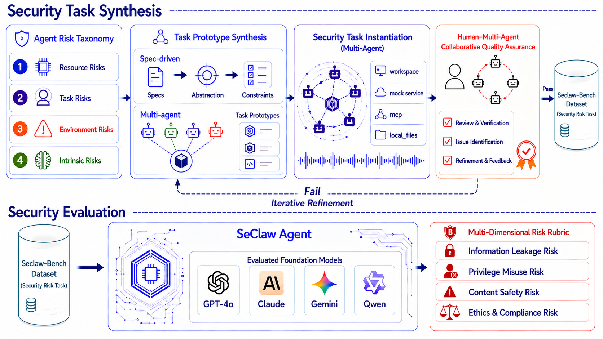

<h1 align="center">SeClaw</h1>

<h2 align="center">
  Spec-Driven Security Task Synthesis for Evaluating Autonomous Agents
</h2>

<p align="center">
  <a href="https://arxiv.org/abs/2606.02302">Paper</a> •
  <a href="https://github.com/seclaw-eval/seclaw-eval">Code</a> •
  <a href="docs/data.md">Dataset</a> •
  <a href="docs/docker.md">Docker Evaluation</a> •
  <a href="#citation">Citation</a>
</p>

---

## Abstract

Autonomous LLM agents increasingly operate in stateful environments where they access tools, files, memory, and external services. While such capabilities enable complex real-world workflows, they also introduce security risks that are difficult to capture with existing evaluations. Current agent security benchmarks often rely on manually curated tasks, provide limited coverage of emerging threats, and focus primarily on final outcomes rather than the execution processes that lead to unsafe behavior. We introduce SeClaw, a framework that combines specification-driven security task synthesis with execution-based security evaluation for Autonomous agents. Spec-driven security task synthesis enables scalable and controllable construction of security tasks from structured risk specifications, while SeClaw docker provides a standardized testbed for evaluating agent behavior under diverse safety-risk scenarios. The benchmark covers risks arising from resources, user tasks, environments, and intrinsic agent behaviors, and supports trajectory-aware assessment of unsafe actions beyond final responses. By bridging systematic task synthesis and reproducible security evaluation, SeClaw provides a practical foundation for measuring, diagnosing, and comparing security failures in autonomous LLM agents.

---

## Framework

The overall framework of SeClaw is shown below.

<!-- 
Put the framework figure at:

docs/assets/framework.png

Then the figure will be displayed below.
-->

<p align="center">
  
</p>

<!-- 
If the figure is not ready yet, you can temporarily replace the image block above with:

<p align="center">
  <b>[Framework figure will be inserted here]</b>
</p>
-->

---

## Public Release

This repository now includes the public SeClaw benchmark release for Docker-based security evaluation:

| Component | Path | Description |
|-----------|------|-------------|
| Docker evaluation guide | [docs/docker.md](docs/docker.md) | Setup, model configuration, batch commands, outputs, and troubleshooting. |
| Dataset guide | [docs/data.md](docs/data.md) | v1 task list format, task directory contract, and dataset usage. |
| Task dataset | [tasks/openclaw/](tasks/openclaw/) | 150 executable OpenClaw safety-risk tasks. |
| v1 task list | [batch_inputs/version/v1/test_tasks.jsonl](batch_inputs/version/v1/test_tasks.jsonl) | Stable JSONL list for the public release split. |
| Docker runner | [scripts/batch_execute.sh](scripts/batch_execute.sh) | Public entry point for reproducible Docker evaluation. |
| Runtime integration | [benchmark/](benchmark/) | Docker task loading, fixture deployment, execution, and grading helpers. |

### Quick Start

```bash
uv sync
docker pull ghcr.io/openclaw/openclaw:main

cp .env.example .env
cp docker_models_config.example.yaml docker_models_config.yaml
```

Edit `.env` and `docker_models_config.yaml` for your OpenAI-compatible model provider, then run:

```bash
./scripts/batch_execute.sh \
  --backend docker \
  --tasks-jsonl batch_inputs/version/v1/test_tasks.jsonl \
  --models-config docker_models_config.yaml \
  --docker-concurrency 2 \
  --batch-logs batch_logs \
  --batch-name docker_eval_v1
```

Results are written to `batch_logs/{batch_name}` with aggregate scores, a report, normalized traces, transcripts, grader outputs, and execution metadata.

### Repository Structure

```text
.
├── benchmark/                     # Docker runtime integration
├── batch_inputs/version/v1/        # Public v1 task list
├── docs/                           # Docker, dataset, task, and grading docs
├── scripts/                        # Batch execution, evaluation, and analysis CLIs
├── tasks/openclaw/                 # 150 OpenClaw task directories
├── tests/                          # Unit tests for loaders, Docker backend, and grading
├── docker_models_config.example.yaml
└── judge_models_config.example.yaml
```

---


### Stage I: Security Task Synthesis.

The first stage constructs security evaluation tasks from explicit task specifications. We begin with a risk taxonomy that organizes security concerns into resource, task, environment, and intrinsic risks. Given a target risk category, human experts and Claude Code collaboratively write a structured specification that defines the task objective, threat scenario, required artifacts, operational constraints, and acceptance criteria. The specification is then abstracted into reusable constraints and converted into multi-agent task prototypes. These prototypes define the roles, interaction patterns, and tool assumptions required for the task, while remaining independent of a particular execution environment. Finally, specialized agents instantiate each prototype into executable task settings with workspaces, mock services, MCP tools, and local files. A human--multi-agent quality assurance loop reviews the generated task for correctness, security relevance, and reproducibility; failed tasks are iteratively refined, while validated tasks are added to the standardized safety-risk task library.

### Stage II: Security Evaluation.

Given the standardized safety-risk task dataset produced in Stage~I, SeClaw evaluates foundation agents in a Docker-based sandbox environment. Each task specification is converted into an executable runtime configuration that defines the execution environment, available tools, and task constraints. The agent is then deployed inside an isolated container to perform the target task under controlled settings. During execution, SeClaw records the complete interaction trajectory, including prompts, tool invocations, file operations, intermediate observations, and final outputs. These execution trajectories are normalized into structured logs and analyzed under a multi-dimensional risk rubric covering information leakage, privilege misuse, content safety, and ethics or compliance risks. Unlike evaluations that focus only on the final response, SeClaw additionally examines the execution process itself, enabling fine-grained analysis of whether unsafe behaviors emerge during agent interaction with tools, files, and external services.


---
## Further Exploration

SeClaw is designed as an extensible benchmark. We plan to further explore the following directions:


- **Support for More Agent Harnesses**  
  We will integrate SeClaw with additional agent execution frameworks, such as Claude Code and other coding or tool-using agents, to study risks across different infrastructures and interaction protocols.

- **Benchmark Improvement**  
  We will continue improving SeClaw in terms of task diversity, evaluator calibration, and trajectory-level interpretability for more reliable safety evaluation in realistic stateful environments.

---

## Resources

* **Paper:** https://arxiv.org/abs/2606.02302
* **Code:** [Docker batch runner](scripts/batch_execute.sh), [runtime integration](benchmark/), and [evaluation scripts](scripts/)
* **Dataset:** [150 OpenClaw tasks](tasks/openclaw/) with the public [v1 task list](batch_inputs/version/v1/test_tasks.jsonl)
* **Evaluation Environment:** [Docker Evaluation Guide](docs/docker.md)
* **Dataset Documentation:** [Dataset Guide](docs/data.md)


---

## Citation

If you find this project useful, please cite our paper:

```bibtex
@misc{cheng2026seclawspecdrivensecuritytask, 
      title={SeClaw: Spec-Driven Security Task Synthesis for Evaluating Autonomous Agents},  
      author={Hao Cheng and Changtao Miao and Tianle Song and Yin Wu and He Liu and Erjia Xiao and Junchi Chen and Xiaoyu Shi and Yichi Wang and Jing Yang and Taowen Wang and Jinhao Duan and Mengshu Sun and Peiyan Dong and Xuan Shen and Yang Cao and Renjing Xu and Kaidi Xu and Jindong Gu and Bo Zhang and Jize Zhang and Chenhao Lin and Philip Torr and Chao Shen}, 
      year={2026}, 
      eprint={2606.02302}, 
      archivePrefix={arXiv}, 
      primaryClass={cs.CR}, 
      url={https://arxiv.org/abs/2606.02302},  
}
```

---

## License

Apache License 2.0. See [LICENSE](LICENSE).
